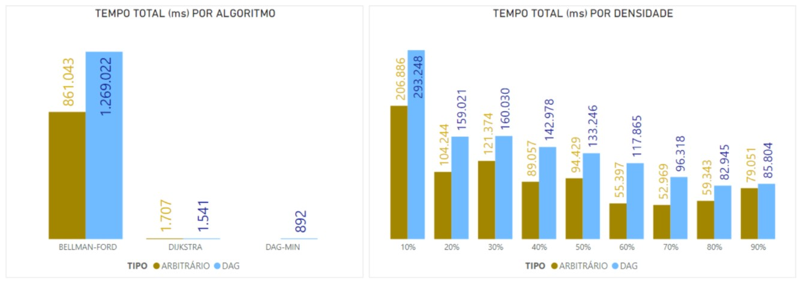
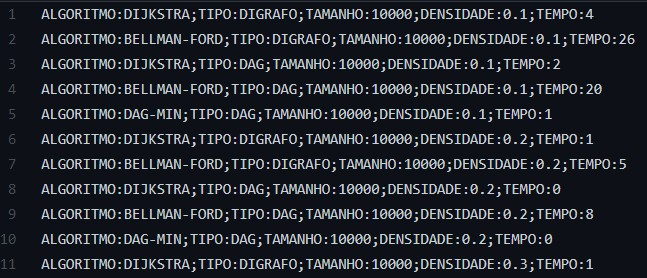

## Caminhos mínimos de única origem

O objetivo deste Exercício Programa é implementar os algoritmos de **Bellman-Ford** e **Dijkstra** para resolver o problema de caminhos mínimos de única origem. 

 

---
### Estrutura das Classes

- **Main**
    - Classe que ~~(meio obviamente)~~ contém o método `main`, ou seja, o que é chamado ao se iniciar o programa, e com isso gerencia um loop para rodar uma série de simulações (através do objeto *Simulacao* conforme descrito abaixo) que testam diferentes parâmetros para os **tamanhos** e **densidades** de grafos. Isso é importante para evitar o enviesamento dos resultados ao se comparar o desempenho e o comportamento dos algoritmos;  assim, é possível tirar conclusões dentro de uma mesma ordem de grandeza.
    
     

    - Exemplo de análise:

        

- **Simulação**
    -  Responsável por executar uma simulação completa dos 2 algoritmos, dado o **tamanho**, uma **probabilidade** e um **custo máximo**. Isso é feito gerando inicialmente um Digrafo "normal" e rodando os algoritmos e depois é gerado um DAG *(Directed Acyclic Graphs - Digrafo Acíclico)* e rodado novamente os algoritmos. 
    Nesse processo também são calculados os tempos gastos para processamento (através do objeto *MedidorTempo*, conforme descrito abaixo), e por fim, são armazenados os resultados num arquivo **log** para análise posterior.

     

    - Exemplo do arquivo de log (usado como base para gerar o gráfico acima):

        

     

- **Digrafo**
    - Classe responsável por armazenar a estrutura do digrafo, ou seja, a **quantidade de vértices**, o **número de arcos** e o estado de conexão entre os vértices (**lista de adjacência**), representado por instâncias do *Link*, conforme descrito abaixo.

     

- **DagMin**
    - Com essa classe é possível instanciar objetos que representam o grafo acíclico dirigido (DAG), ou seja, isso significa que se existir um caminho entre os vértices A e B, nenhum vértice deve ser "visitado" mais do que 1 vez.
     Para isso, é preciso fornecer um objeto do tipo **Digrafo** (conforme explicado acima) e um **vértice de origem** e então é feita a ordenação topológica, usando uma estrutura de dados do tipo **pilha**.
     Essa classe também disponibiliza o método **caminhosMinimos()**, que executa o algoritmo que calcula a distância, fazendo todo o processo de inicialização dos vértices, o relaxamento dos arcos, entre outros detalhes, conforme descrito na literatura.
    
     

- **Link**
    - Classe responsável por armazenar o estado de conexão entre os vértices (arcos), contendo a **posição do vértice de destino**, o **custo** e um apontamento pra outro objeto do tipo **Link**.

     

- **BellmanFord**
    - Esta classe é responsável por implementar o algoritmo de **Bellman-Ford**,  e também disponibiliza um método **caminhosMinimos()** para executar o mesmo, necessitando para isso, receber um objeto do tipo **Digrafo**, um **vértice de origem** e um **custo máximo**.

     

- **Dijkstra**
    - Classe que implementa o algoritmo de **Dijkstra**, e também disponibiliza um método **caminhosMinimos()** para executar o mesmo, necessitando para isso, receber um objeto do tipo **Digrafo** e um **vértice de origem**.

     

- **MinHeap**
    -  Nesta classe é implementado a estrutura de dados "Heap" (mais especificamente min-heap), que permite armazenar um conjunto de elementos de forma ordenada, de modo que o primeiro elemento é o menor, e o último é o maior. São disponbilizados métodos para inserir, remover e atualizar os elementos. 
     Isso é usado como uma fila de prioridade para a execução do algoritmo de **Dijkstra**.

     

- **MedidorTempo**
    - Responsável por calcular o tempo total gasto em cada simulação de cada algoritmo; para não existir interferência nos valores devido a outros processos rodando na máquina durante as simulações, foi usado a classe **ManagementFactory** e **ThreadMXBean**, retornando o tempo total de CPU para o processo específico atual em nanossegundos, que depois foi convertido para milissegundos para melhor visualização.

     

---
### Compilação e Execução
Para compilar o código, basta executar o comando: `javac Main.java`

Para execucar o programa, basta executar o comando: `java Main`

 

---
**Créditos**

Professor: Alexandre Freire

Aluno: José Rafael R. Nascimento

Aluno: Luiz Fernando Conceição dos Santos

